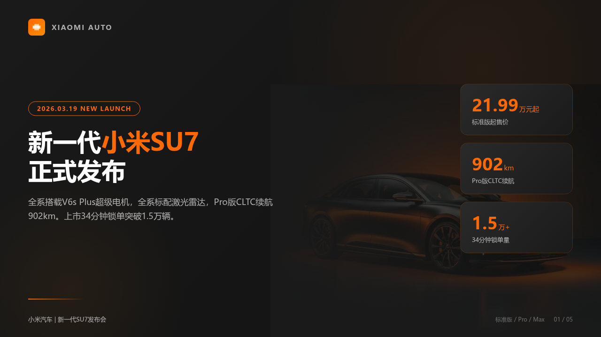
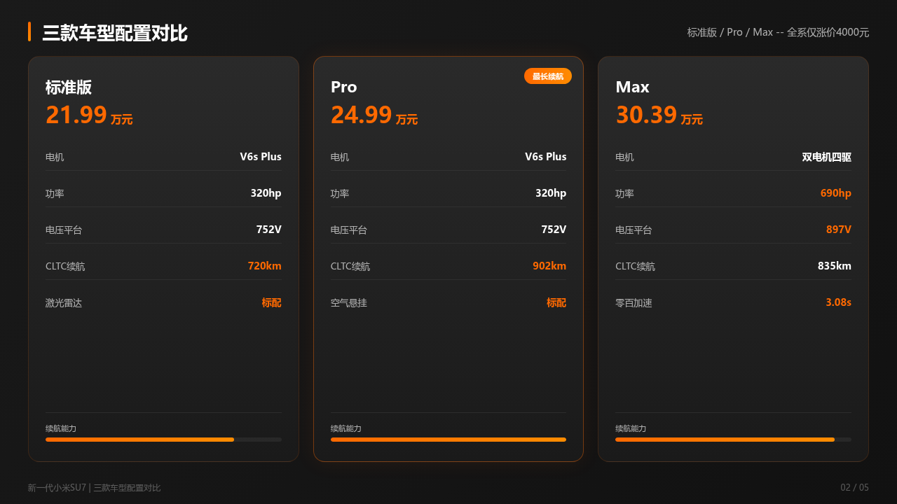
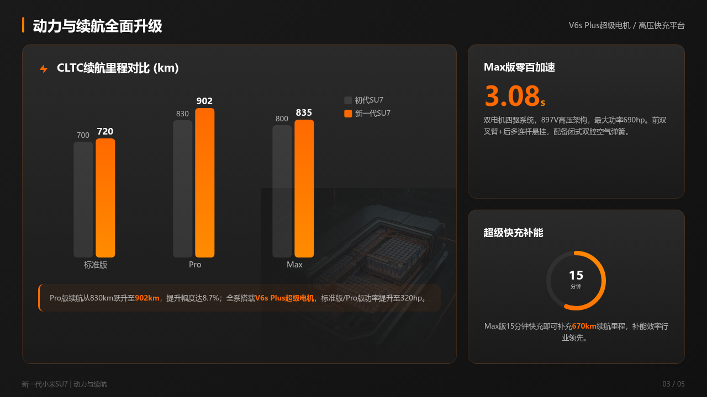
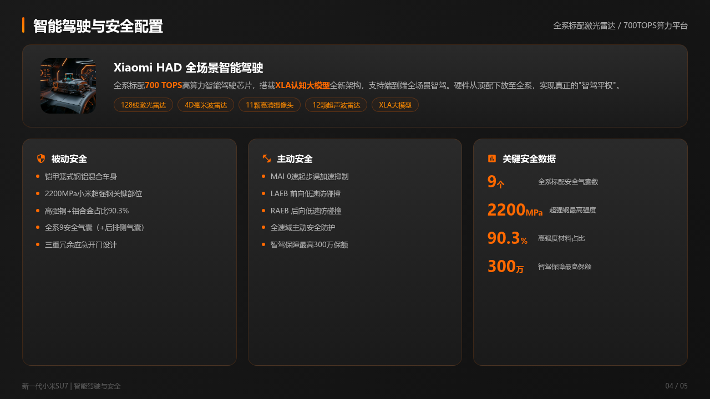
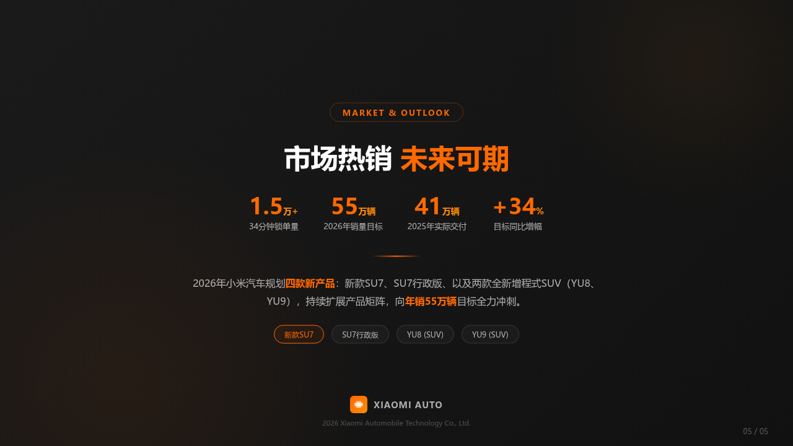

# PPT Agent Skill

**[English](README_EN.md)**

> 模仿万元/页级别 PPT 设计公司的完整工作流，输出高质量 HTML 演示文稿 + 可编辑矢量 PPTX。

## 工作流概览

```
需求调研 → 资料搜集 → 大纲策划 → 策划稿 → 风格+配图+HTML设计稿 → 后处理(SVG+PPTX)
```

## 效果展示

> 以「新一代小米SU7发布」为主题的示例输出（小米橙风格）：

| 封面页 | 配置对比页 |
|:---:|:---:|
|  |  |

| 动力续航页 | 智驾安全页 |
|:---:|:---:|
|  |  |

| 结束页 |
|:---:|
|  |


## 核心特性

| 特性 | 说明 |
|------|------|
| **6步Pipeline** | 需求 → 搜索 → 大纲 → 策划 → 设计 → 后处理，模拟专业 PPT 公司工作流 |
| **8种预置风格** | 暗黑科技 / 小米橙 / 蓝白商务 / 朱红宫墙 / 清新自然 / 紫金奢华 / 极简灰白 / 活力彩虹 |
| **Bento Grid 布局** | 10 种卡片式灵活布局，内容驱动版式 |
| **智能配图** | AI 生成配图 + 5 种视觉融入技法（渐隐融合/色调蒙版/氛围底图等） |
| **排版系统** | 7 级字号阶梯 + 间距层级 + 中英文混排规则 |
| **色彩比例** | 60-30-10 法则 + accent 色使用约束 |
| **数据可视化** | 13 种纯 CSS/SVG 图表（进度条/环形图/迷你折线/点阵图/KPI 卡/雷达图/漏斗图等） |
| **跨页叙事** | 密度交替节奏 / 章节色彩递进 / 封面-结尾呼应 / 渐进揭示 |
| **页脚系统** | 统一页脚（章节信息 + 页码），跨页导航 |
| **PPTX 兼容** | HTML → SVG → PPTX 管线，PPT 365 中右键"转换为形状"即可编辑 |

## 输出产物

| 文件 | 说明 |
|------|------|
| `preview.html` | 浏览器翻页预览（自动生成） |
| `presentation.pptx` | PPTX 文件，PPT 365 中右键"转换为形状"可编辑 |
| `svg/*.svg` | 单页矢量 SVG，可直接拖入 PPT |
| `slides/*.html` | 单页 HTML 源文件 |

## 环境依赖

**必须：**
- **Node.js** >= 18（Puppeteer + dom-to-svg）
- **Python** >= 3.8
- **python-pptx**（PPTX 生成）

**一键安装：**
```bash
pip install python-pptx lxml Pillow
npm install puppeteer dom-to-svg
```

## 目录结构

```
ppt-agent-skill/
  SKILL.md                    # 主工作流指令（Agent 入口）
  README.md                   # 本文件
  README_EN.md                # English documentation
  references/
    prompts.md                # Prompt + 资源索引
    prompts/                  # 6 个 Prompt 模板
    styles/                   # 8 种预置风格（每种独立文件 + README 决策规则）
    layouts/                  # 10 种布局（每种独立文件 + README 画布参数）
    charts/                   # 13 种图表模板（每种独立文件 + README 选择指南）
    icons/                    # 4 类 SVG 图标（每类独立文件 + README 使用规则）
    page-templates/           # 封面/目录/章节封面/结束页 HTML 骨架
    narrative-rhythm.md       # 叙事节奏与视觉重量
    image-generation.md       # 配图 Prompt + 融入技法
    pipeline-compat.md        # 管线兼容性约束
    method.md                 # 核心方法论
  scripts/
    html_packager.py          # 多页 HTML 合并为翻页预览
    html2svg.py               # HTML → SVG（dom-to-svg，保留文字可编辑）
    svg2pptx.py               # SVG → PPTX（OOXML 原生 SVG 嵌入）
```

## 使用方式

在对话中直接描述你的需求即可触发，Agent 会自动执行完整 6 步工作流：

```
你："帮我做一个关于 X 的 PPT"
  → Agent 提问调研需求（等你回复）
  → 自动搜索资料 → 生成大纲 → 策划稿 → 逐页设计 HTML
  → 自动后处理：HTML → SVG → PPTX
  → 输出全部产物到 ppt-output/
```

**触发示例**：

| 场景 | 说法 |
|------|------|
| 纯主题 | "帮我做个 PPT" / "做一个关于 X 的演示" |
| 带素材 | "把这篇文档做成 PPT" / "用这份报告做 slides" |
| 带要求 | "做 15 页暗黑风的 AI 安全汇报材料" |
| 隐式触发 | "我要给老板汇报 Y" / "做个培训课件" / "做路演 deck" |

> 全程无需手动执行任何脚本，所有后处理（预览合并、SVG 转换、PPTX 生成）由 Agent 在 Step 6 自动完成。

## 许可证

[MIT](LICENSE)
