<div align="center">
  
  <h1>PPT Agent</h1>
  <p><strong>Applying rigorous software engineering to presentation generation.</strong></p>

  <p>
    <a href="#quick-start-as-an-agent-skill"></a>
    <a href="README.md"></a>
    <a href="LICENSE"></a>
  </p>

  <p>
    
    
    
    
    
    
  </p>
</div>

---

**PPT Agent** is a code-driven, artifact-oriented workflow engine designed for automated presentation generation.

Unlike conventional zero-shot LLM generators that often result in contextual errors and layout overlaps, PPT Agent mitigates these risks through formal architectural decoupling. 

The framework employs phase-isolated Subagent orchestration, strict data validation contracts, and programmatic Pixel-Sensitive Visual QA. It maps structured narrative logic into high-fidelity, highly editable cross-platform PPTX files.

## Architectural Innovations

PPT Agent targets issues involving context degradation and UI rendering unreliability inherent in long-prompt LLM tasks via the following optimizations:

### Phase-Isolated Subagent Orchestration
The system replaces traditional monolithic playbooks with highly targeted execution environments. For stages including Information Retrieval (Research), Narrative Outlining (Outline), Theming (Style), and Layout Assembly (Planning), it supplies isolated agent contexts restricted to minimal prompt requirements. The global `MAIN_MODEL` parameter is explicitly mapped across the entire chain to prevent context poisoning and model degradation.

### Closed-Loop Visual QA Automation
To resolve rendering overlaps programmatically, an automated screenshot-driven audit pipeline was implemented. Following the synthesis of an HTML slide, the engine captures a low-resolution web preview, channeling it back to the LLM for objective visual verification. Upon detecting DOM intersection or margin overflows, the agent systematically restructures the DOM hierarchy and core CSS definitions—rather than modifying marginal values natively—to resolve structural flaws.

### Stateless Infrastructure
The framework entirely abandons central state trackers like `progress.json`. Long-running execution, fault tolerance, and workflow resumption depend entirely on tracking concrete intermediary artifacts committed to the disk (e.g., `outline.md`, `style.json`). This ensures verifiable state deduction without runtime fragility.

### Abstracted Data and Render Boundaries
Slide contents are strictly synthesized into a JSON data contract against over 60+ UI asset definitions. A synchronous IO validator analyzes the structural variables before they enter the HTML component compiler, effectively preventing syntax failures and hallucinated components.

---

## Enterprise-Grade Dual Export Pipeline

To secure platform portability while preserving editability, two parallel rendering mechanisms are deployed:
- **PNG Raster Pipeline (`presentation-png.pptx`)**: Assures absolute cross-platform visual consistency. Complex glassmorphism rendering and typography are captured identically across differing client ecosystems.
- **SVG Vector Pipeline (`presentation-svg.pptx`)**: Outputs scalable vectors allowing unbounded scaling while preserving foundational text editing capabilities for final offline alterations.

<details>
  <summary><b>Click to expand: Visual Output Reference</b></summary>
  <div align="center">
    <br/>
    
    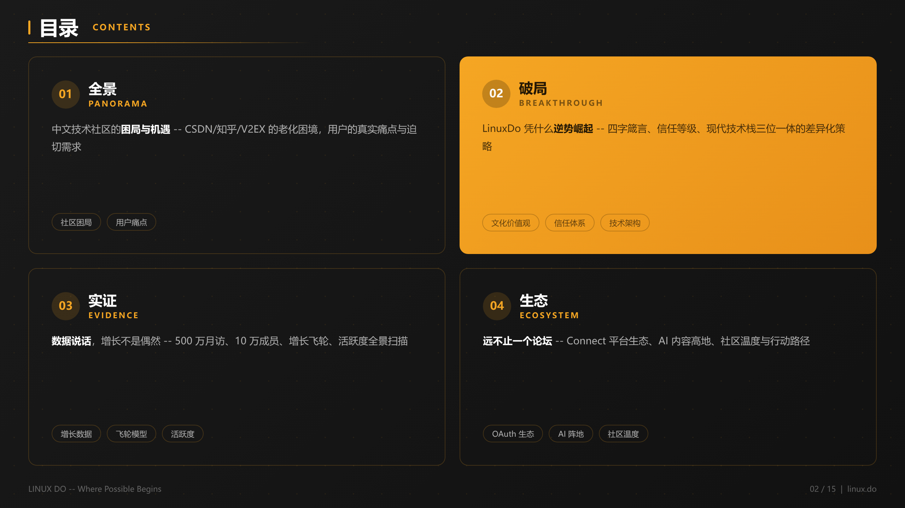
    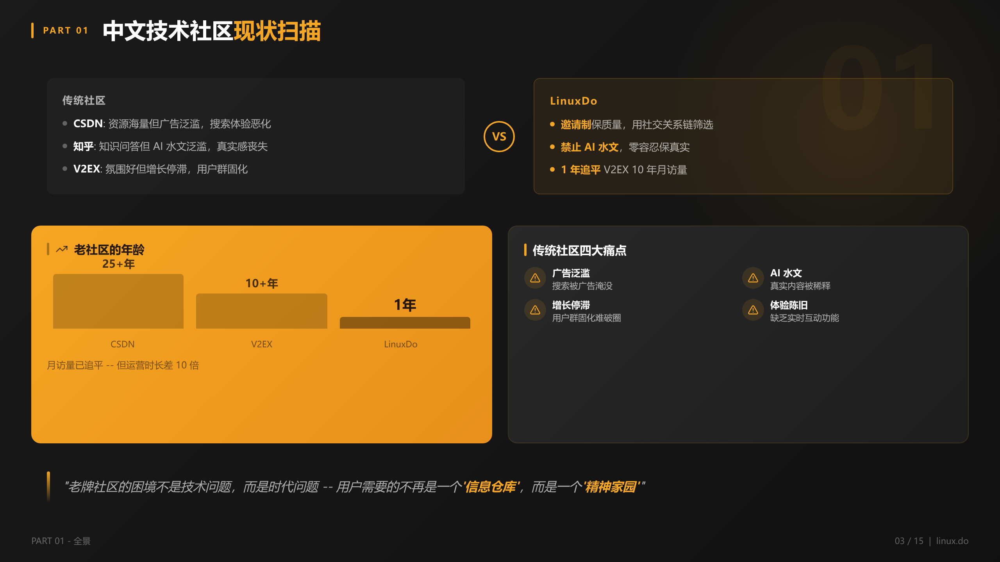
    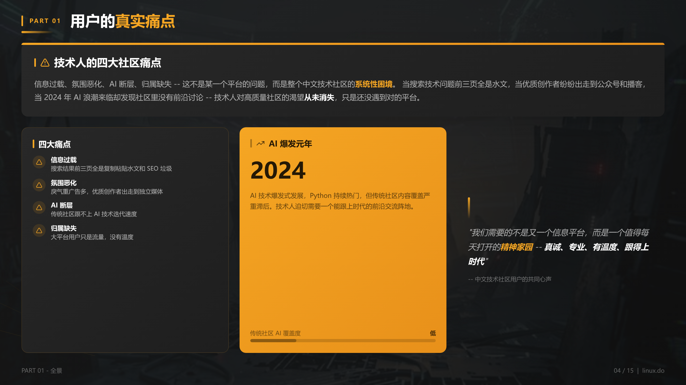
    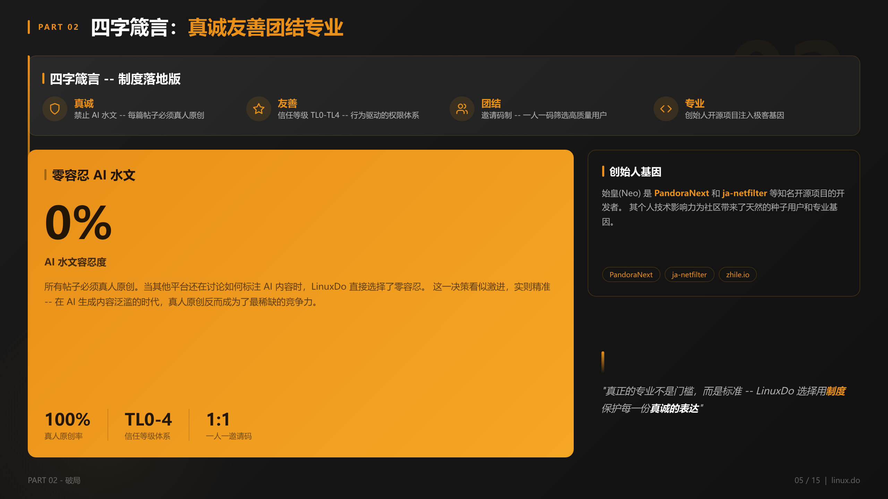
    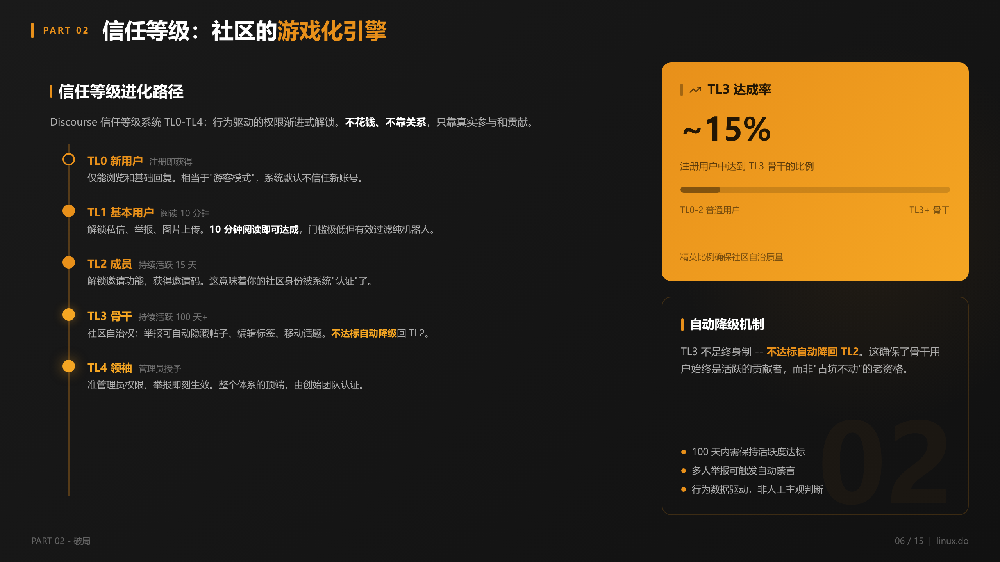
    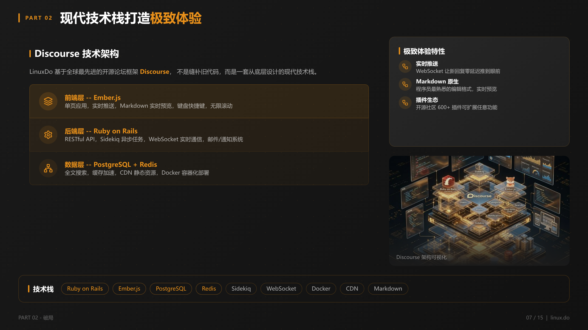
    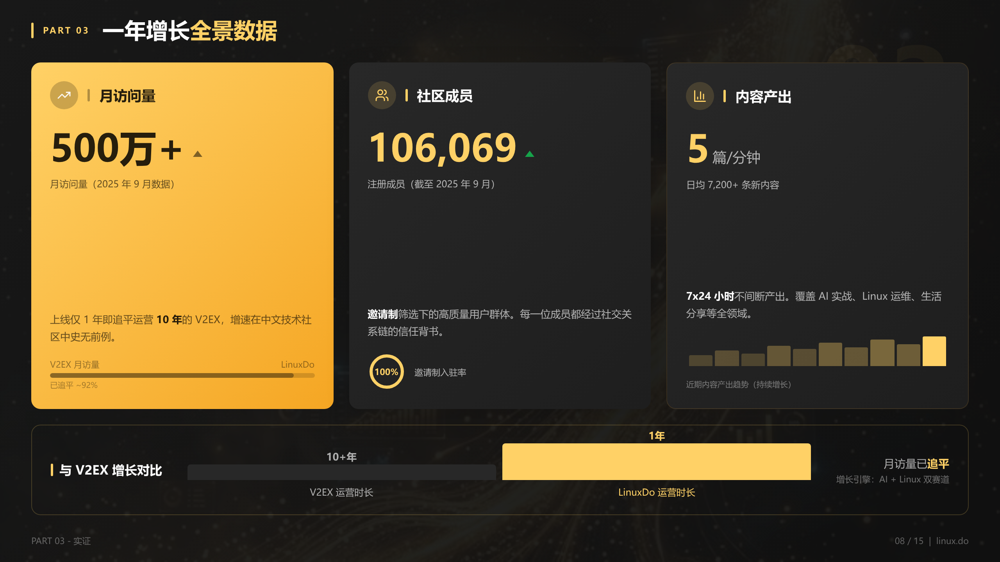
    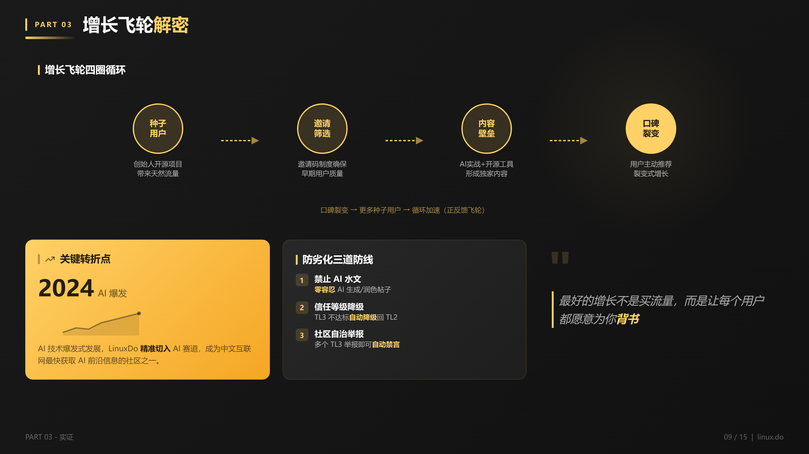
    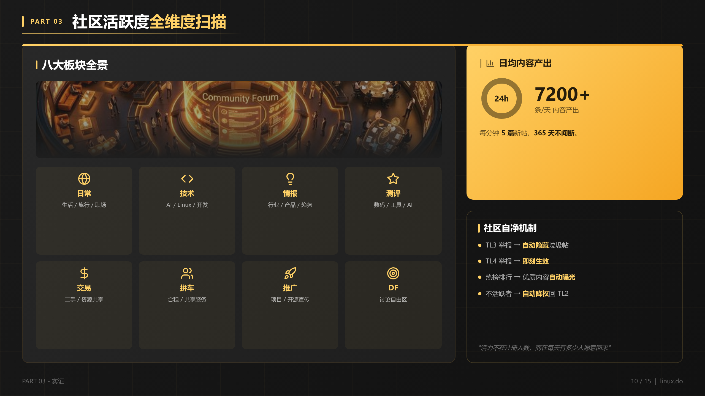
    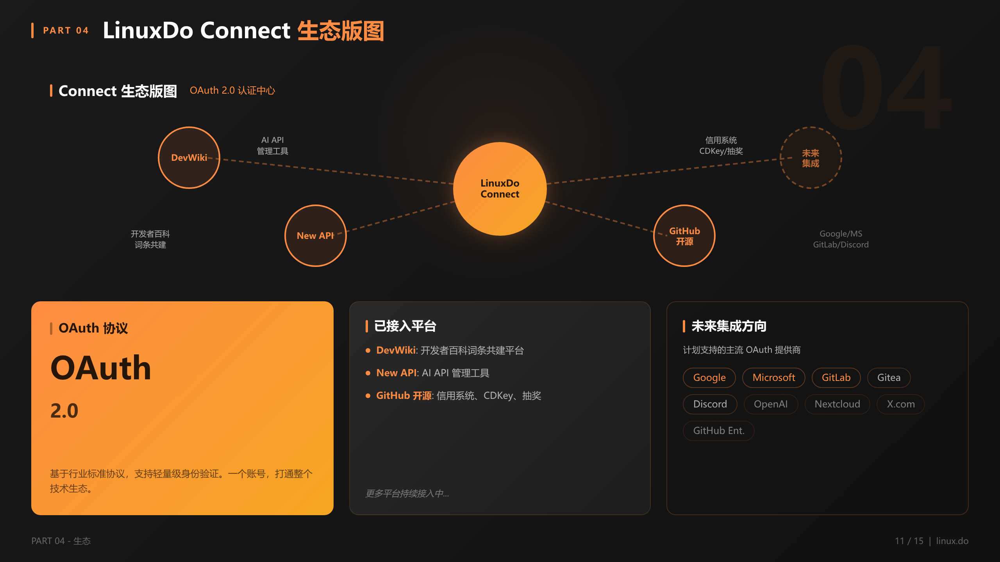
    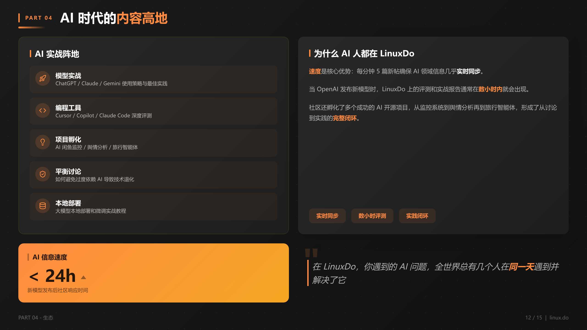
    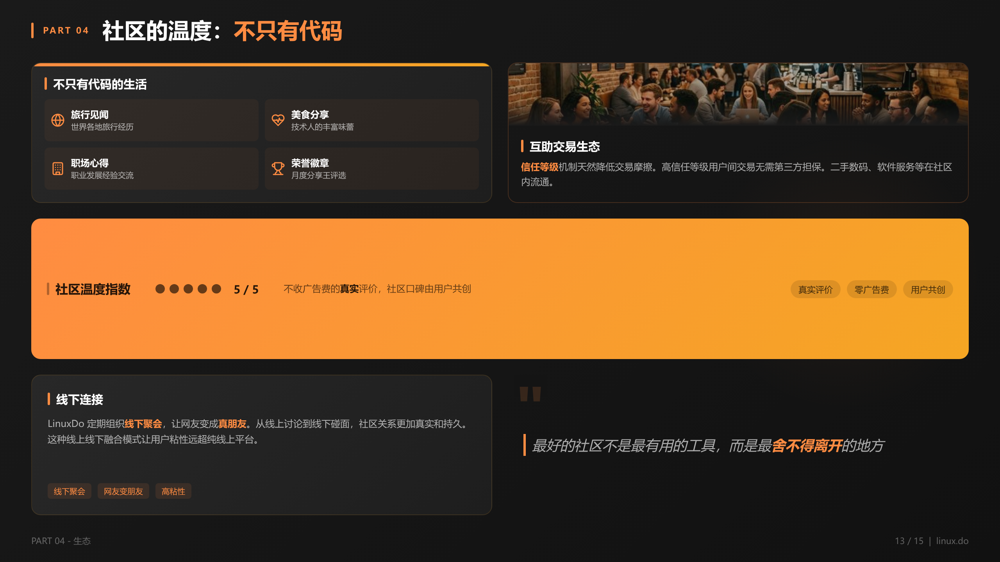
  </div>
</details>

---

## The Six-Stage Pipeline

Processing occurs via a highly linear, gated workflow:

1. **Intention Parsing**: Verifies domain constraints and activates web research plugins based on user queries.
2. **Context Mining**: Operates internet search tools to establish objective knowledge graphs.
3. **Structured Modeling**: Instantiates logical arguments into rigorous Markdown structures observing pyramid principles.
4. **Style Protocol Mapping**: Freezes global thematic variables (`style.json`) across the entire deck prior to layout assembly.
5. **View Assembly & Visual QA Loop**: Maps generated views per slide, generates visual endpoints, and executes collision validation and layout corrections sequentially.
6. **Compilation and Delivery**: Formats the web preview gallery and invokes Node.js environments to generate the native twin-route PowerPoint files.

---

## Quick Start as an Agent Skill

The application is deployed solely as a fully integrated **AI Agent Skill**.

A complex manual environment config is bypassed. Triggers are executed via standard conversational directives in the overarching IDE:

> *"Report on the comprehensive outlook of embodied AI for 2026 over 15 pages. Present a highly coherent analysis structured with a dark-themed cyber design motif."*

After processing all checkpoints seamlessly, the HTML preview and PPTX binaries are committed to the directory layout:
📁 `ppt-output/runs/<RUN_ID>/`

---

## Immutable Directory Architecture

Project taxonomy precisely mirrors the stage isolation protocols established above:

```text
ppt-agent-skill/
├── SKILL.md                 # Primary Controller: Evaluates machine state transitions, pipeline integrity, and iteration limits.
├── scripts/                 # Runtime Environment: Headless IO integrations, Python/Node.js validators (stateless operations).
├── references/              # Static Asset Repository: Provides exact Markdown documentation invoked temporally.
│   ├── playbooks/           # Phase-specific execution guides (Outline, Style, Planning, etc.)
│   ├── prompts/             # Minified context configurations.
│   ├── layout & charts ...  # Architectural patterns defining logical to visual conversion bounds.
│   └── README.md            
├── assets/                  # Public relations media.
└── ...
```

## License

[MIT License](LICENSE)
